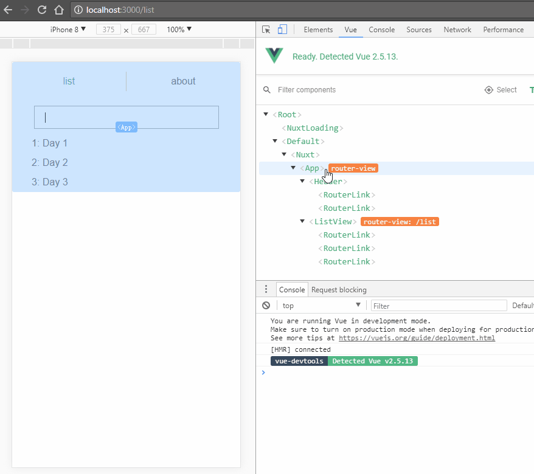

# vue-ssr

模板项目，用于快速开始使用Vue和Nuxt开发建站。

## 架构特性

单/多页面应用，服务器端渲染页面组件、控制路由。使用vue、vue-loader、vue-router、vuex、nuxt。

## 构建和启动命令

``` bash
# install dependencies
$ npm install

# serve with hot reload at localhost:3000
$ npm run dev

# build for production and launch server
$ npm run build
$ npm start

# generate static project
$ npm run generate
```

详见[Nuxt.js](https://github.com/nuxt/nuxt.js)[文档](https://zh.nuxtjs.org/guide/commands).

## 文件结构

| Path | Content |
| :--- | :--- |
| /nuxt.config.js | Nuxt配置文件。 |
| /app.html | 模板。可选。 |
| /layouts | 布局，包括默认布局、错误页面、个性化布局等。可选。 |
| /pages | 页面组件。 |
| /components | 组件。 |
| /assets | 资源文件。 |
| /client | 其他前端文件。 |
| /apis | 接口中间件。 |
| /middleware | 中间件。 |
| /plugins | 插件，Vue插件等。 |
| /store | Vuex状态存储。 |
| /static | 静态文件。 |

## 快速开发

可参考示例代码进行组件、路由、状态数据的快速开发。


